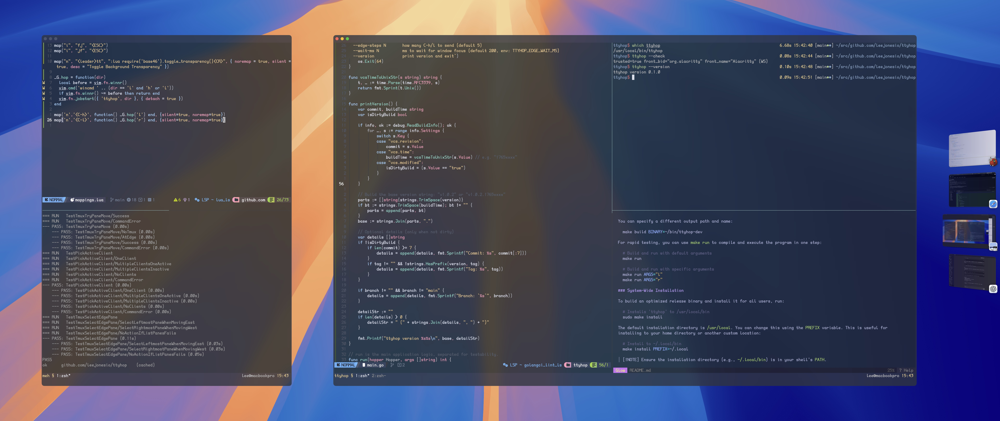

# ttyhop: seamless Alacritty & tmux navigation

`ttyhop` is a small **macOS** utility for navigating seamlessly between **Alacritty** windows and **tmux** panes using `C-h` and `C-l`, designed for complex, multi-window workflows.



## The "Why"

I use a 40" ultrawide monitor, often split into a 1/3 and 2/3 layout (with padding). My typical setup involves one **Alacritty** window running tests in the first third, and another **Alacritty** window hosting a **tmux** session (with multiple panes) in the remaining two-thirds.

You might wonder, "Why not just use one **Alacritty** window with more **tmux** panes?" The reason is flexibility. With some clever **QMK** firmware and **Hammerspoon** scripts, I can instantly swap the entire leftmost **Alacritty** window with another application, like a browser or chat client. This creates a blissful, highly efficient working environment that `ttyhop` makes seamless to navigate.

Navigating this setup was clunky. I wanted to use `C-h` and `C-l` to move left and right across every split and window as if they were all native panes in a single application. This tool makes that possible.

`ttyhop` creates a fluid navigation experience across:
- **Neovim** splits
- **tmux** panes
- **Alacritty** windows

It's fast, lightweight, and uses native **macOS Accessibility APIs** and **tmux IPC**, with no need for heavier tools like **Hammerspoon**.

A final, crucial benefit is preserving my nervous habit of hitting `C-l` to clear the terminal. Since my main terminal is usually my rightmost pane, the `ttyhop` command fails when I try to move further right. This failure allows the `|| tmux send-keys C-l` part of the binding to execute, passing the command through to the shell and clearing my screen as intended.

## How It Works

When you press `C-h` or `C-l` (via a **tmux** binding), `ttyhop` follows this logic:

1.  **Inside tmux?** If there's a **tmux** pane to the left/right, it moves there.
2.  **At the edge of tmux?** It uses the **macOS Accessibility API** to find the nearest adjacent **Alacritty** window to the left/right.
3.  **Hops Windows:** It focuses the target window and intelligently selects the correct edge pane (e.g., when moving right, it lands on the leftmost pane of the new window).
4.  **Nowhere to go?** If there's no pane or window in the desired direction, it does nothing, allowing the key-press to fall through to the shell.

## Requirements

- **macOS**
- **Go** (with CGO enabled)
- **Xcode Command Line Tools**
- `tmux` installed and available in your `PATH`.

## Installation & Setup

**1. Clone and Build**

First, clone the repository to your local machine:
```bash
git clone https://github.com/leejonesio/ttyhop.git
cd ttyhop
```

**2. Choose Your Method**

You have two primary options: building for development or installing for system-wide use.

### Development Build

The `Makefile` provides several targets for common development tasks. You can run `make help` at any time to see a full list of available commands.

To create a standard development binary, run:
```bash
# Creates the 'ttyhop' binary in the current directory
make build
```
You can specify a different output path and name:
```bash
make build BINARY=~/bin/ttyhop-dev
```

For rapid testing, you can use `make run` to compile and execute the program in one step:
```bash
# Build and run with default arguments
make run

# Build and run with specific arguments
make run ARGS="l"
make run ARGS="r"
```

### System-Wide Installation
To build an optimized release binary and install it for all users, run:
```bash
# Installs 'ttyhop' to /usr/local/bin
sudo make install
```
The default installation directory is `/usr/local`. You can change this using the `PREFIX` variable. This is useful for installing to your home directory or another custom location:
```bash
# Install to ~/.local/bin
make install PREFIX=~/.local
```
> [!NOTE]
> Ensure the installation directory (e.g., `~/.local/bin`) is in your shell's `PATH`.

### Creating a Release
This project uses a GitHub Actions workflow to automate releases. The process is triggered by pushing a new version tag to the `main` branch.

The `Makefile` provides a convenient command to handle this for you. First, ensure you are on the `main` branch with no uncommitted changes, then simply run:
```bash
make release
```

This command will:
1.  Determine the next semantic version number by incrementing the latest git tag.
2.  Create a new git tag with that version.
3.  Push the tag to the `origin` remote.

Pushing the tag automatically triggers the `release` workflow, which will build the binary, create a new GitHub Release, and upload the compiled binary to it. You can monitor its progress in the "Actions" tab of the repository.

### Install from a Release
If you don't have a **Go** development environment, you can install `ttyhop` directly from a pre-compiled binary.

1.  Go to the [**Releases**](https://github.com/leejonesio/ttyhop/releases) page and download the binary for your desired version.

    As an alternative for command-line users, you can use `curl` to download a specific version directly. For example, to download `v0.1.0`:
    ```bash
    curl -L -o ttyhop https://github.com/leejonesio/ttyhop/releases/download/v0.1.0/ttyhop
    ```
    Remember to replace `v0.1.0` with the version you wish to install.

2.  Make the binary executable:
    ```bash
    chmod +x ./ttyhop
    ```
3.  When you download a binary using a web browser, **macOS Gatekeeper** will most likely quarantine the application. To remove this attribute and allow the binary to run, execute the following command:
    ```bash
    xattr -d com.apple.quarantine ./ttyhop 2>/dev/null
    ```
4.  Move the binary to a directory in your `PATH`:
    ```bash
    sudo mv ./ttyhop /usr/local/bin/ttyhop
    ```

**2. Grant Accessibility Permissions**

The first time you run `ttyhop`, you may be prompted to grant accessibility permissions.

```bash
# Run this to trigger the permissions prompt
ttyhop --check
```

Go to `System Settings → Privacy & Security → Accessibility` and ensure **Alacritty** is enabled.

**3. Configure Your Environment**

To make `ttyhop` work, you need to bind its commands to your desired keys in `tmux`, your shell, or other applications.

### tmux (Primary Method)
This is the recommended setup. Add the following to your **tmux** configuration file (e.g., `~/.tmux.conf` or `~/.config/tmux/tmux.conf`):

```tmux
# Use ttyhop to navigate between tmux panes and alacritty windows
bind -n C-h run-shell 'ttyhop l || tmux send-keys C-h'
bind -n C-l run-shell 'ttyhop r || tmux send-keys C-l'
```

Reload your **tmux** configuration:
```bash
tmux source-file ~/.config/tmux.conf # or ~/.config/tmux/tmux.conf
```

### Zsh (for shell prompt)
> [!WARNING]
> This is being developed for my own workflow, so apologies for only handling Zsh at the moment.

To enable seamless navigation when you are at a standard shell prompt (outside of tmux), add the following to your `.zshrc`:
```zsh
# ~/.zshrc

if command -v ttyhop >/dev/null 2>&1; then
    eval "$(ttyhop shell zsh)"
    alias th='ttyhop'
fi
```
This configuration is safe and robust:
- It only runs if `ttyhop` is installed and available in your `PATH`.
- It uses `ttyhop shell zsh` to generate the necessary keybindings dynamically.
- If `ttyhop` fails to navigate (e.g., you're at the edge of the screen), it gracefully falls back to the key's default behavior (`C-h` for backspace, `C-l` for clear screen).
- It adds a convenient `th` alias.

### Neovim (Optional)

To make **Neovim**'s split navigation play nicely with `ttyhop`, add this Lua snippet to your configuration (e.g., `lua/custom/mappings.lua`):

```lua
-- This function attempts to navigate a vim split first.
-- If it can't, it calls ttyhop to handle tmux/Alacritty navigation.
local function hop(direction)
  local current_win = vim.fn.winnr()
  vim.cmd('wincmd ' .. (direction == 'l' and 'h' or 'l'))
  if vim.fn.winnr() == current_win then
    -- We didn't move, so let ttyhop take over
    vim.fn.jobstart({ 'ttyhop', direction }, { detach = true })
  end
end

vim.keymap.set('n', '<C-h>', function() hop('l') end, { silent = true, noremap = true, desc = "Hop left" })
vim.keymap.set('n', '<C-l>', function() hop('r') end, { silent = true, noremap = true, desc = "Hop right" })
```
> [!WARNING]
> If you use `vim-tmux-navigator`, you may need to disable its default mappings. In my testing, this setup does not require `vim-tmux-navigator`, but your mileage may vary. You might also need to disable `vim-tmux-navigator`'s wrapping behavior to prevent it from cycling back to the first split when you try to navigate past the last one.
>
> To disable `vim-tmux-navigator`'s default keybindings and wrapping, add the following to your **Neovim** configuration:
> ```lua
> vim.g.tmux_navigator_no_mappings = 1
> vim.g.tmux_navigator_no_wrap = 1
> ```

### Alacritty Key Bindings (Alternative)

If you prefer not to use `tmux` or want to bind `ttyhop` to different keys directly within **Alacritty**, you can add the following to your `~/.config/alacritty/alacritty.toml` file.

This example binds `ttyhop` to `Command-Shift-H` (left) and `Command-Shift-L` (right):

```toml
[keyboard]
bindings = [
    # D-S-h → ttyhop l
    { key = "H", mods = "Command|Shift", command = { program = "ttyhop", args = ["l"] } },
    # D-S-l → ttyhop r
    { key = "L", mods = "Command|Shift", command = { program = "ttyhop", args = ["r"] } }
]
```

**4. Fine-Tuning (Optional)**

You can fine-tune `ttyhop`'s behavior with the following options.

#### Edge Wait Time
When `ttyhop` switches to a new **Alacritty** window, it briefly waits for the window to become active before selecting the correct edge pane in `tmux`. You can control this delay.

- **Flag (Recommended):** `--wait-ms <milliseconds>`
  ```bash
  # Wait for 300 milliseconds
  ttyhop r --wait-ms 300
  ```
- **Environment Variable:** `TTYHOP_EDGE_WAIT_MS`
  ```bash
  # Set for a single command
  TTYHOP_EDGE_WAIT_MS=300 ttyhop r

  # Export for the shell session
  export TTYHOP_EDGE_WAIT_MS=300
  ```
The `--wait-ms` flag always takes precedence over the environment variable. The default value is `200` ms.

> [!NOTE]
> I added this feature as a convenience for others. In my own daily use, the default setting has always been sufficient, but this provides a useful escape hatch if your system requires more time.

## Usage

Once configured, simply use `C-h` and `C-l` to navigate everywhere.

You can also run it directly from the command line:
```bash
ttyhop l
ttyhop r
```

## Troubleshooting

- **Accessibility Not Working?** Run `ttyhop --check` and verify permissions in `System Settings`.
- **Wrong Window Focused?** `ttyhop` only considers horizontally adjacent windows and picks the one with the smallest gap.
- **Enable Logging:** Run `TTYHOP_LOG=1 ttyhop l` for detailed logs.

### Exit Codes
`ttyhop` uses specific exit codes to signal its outcome. This is particularly useful for the `||` operator in shell commands, allowing a fallback action (like `tmux send-keys`) to run only when `ttyhop` fails to navigate.

| Code | Meaning |
|---|---|
| 0 | Success |
| 1 | No-op: Front app is not **Alacritty** |
| 2 | No-op: Could not find a focused window |
| 3 | Error: Could not get the current window's geometry |
| 4 | Error: Could not list **Alacritty** windows |
| 5 | No-op: No neighbor window found in the given direction |
| 10 | Error: Could not get a reference to the frontmost application |
| 20 | Error: Accessibility permissions are not granted |
| 64 | Error: Invalid command-line arguments |

## Disclaimers & Warnings

- **Horizontal Only:** This tool currently only handles horizontal (left/right) navigation. Vertical navigation is not implemented.
- **Early Release:** This is an early release, tested only for my specific use case. It could work perfectly for you, or it could drive you insane.
- **Experiment Safely:** Please test this in a safe environment. I am not responsible for any expletives, frustration, or lost work that may be caused by this application.

## Development Environment

This utility was developed and tested on **macOS Sonoma** with the following tool versions:
- **Go:** `go1.24.2 darwin/arm64`
- **Alacritty:** `0.15.1 (1)`
- **tmux:** `3.5a`
- **Neovim:** `NVIM v0.11.0-release`

> [!NOTE]
> Compatibility with other versions is not guaranteed but may work.

## Contributing

I'll continue to fix bugs and make improvements as I encounter them in my own workflow, but I can't offer any guarantees.

That said, you are welcome to fork the repository, create a pull request, or log an issue. I'm open to incorporating quick wins and valuable community contributions that align with the project's goals.

This was a fun little utility to write. Frustrating at times, but ultimately one of those moments of joy—much like discovering **Vim**'s `.` command. I hope it's of use to someone. Anything that keeps my hands on my keyboard and off a pointing device is a win for me.

## License

MIT
